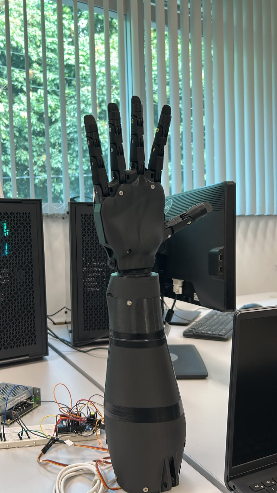
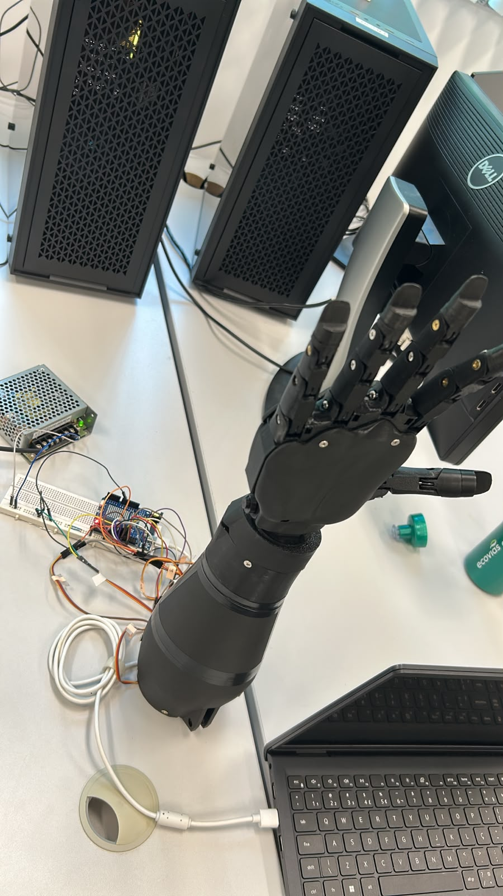
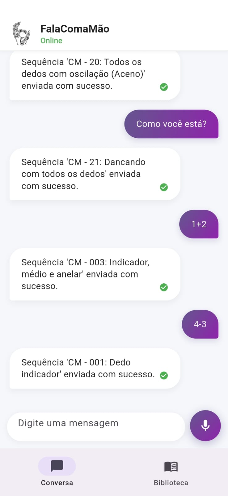
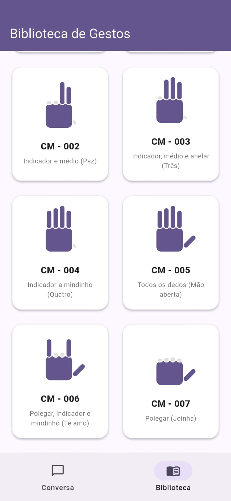
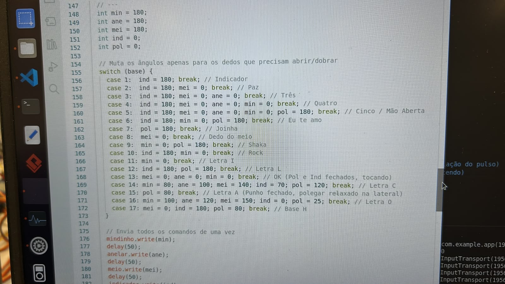
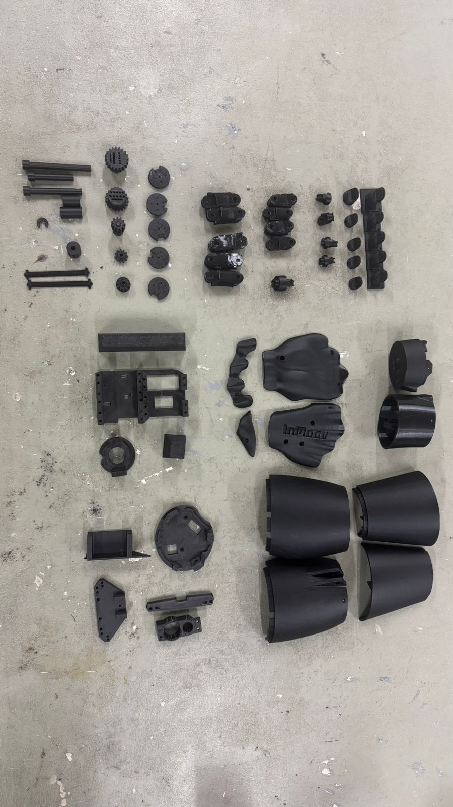

# 🤖 Mão Robótica com Movimentação de Pulso — LIBRAS-BOT / FalaComaMão

> Protótipo de mão robótica de baixo custo, com cinco dedos funcionais e rotação de
> pulso, capaz de reproduzir configurações de mão (CMs) da **Língua Brasileira de Sinais
> (LIBRAS)** a partir de comandos de **voz ou texto**, interpretados por um modelo de
> linguagem (LLM) local.

Projeto desenvolvido para a disciplina de **Projeto Integrado em Computação II (PIC2)**
do curso de **Engenharia de Computação** da **Universidade Federal do Espírito Santo
(UFES)**.

**Status do projeto:** ✅ **Finalizado / funcional.**

🔗 **Repositório público (GitHub):**
<https://github.com/gk27min/Mao-Robotica-com-Movimentacao-de-Pulso>

<p align="center">
  
  
</p>
<p align="center"><em>Protótipo final montado e a bancada de operação (Arduino Uno R4 WiFi, fonte, protoboard e servidor Python no notebook).</em></p>

---

## 📑 Índice

1. [Visão geral](#-visão-geral)
2. [Como funciona (fluxo end-to-end)](#-como-funciona-fluxo-end-to-end)
3. [Arquitetura do sistema](#-arquitetura-do-sistema)
4. [O que foi feito](#-o-que-foi-feito)
5. [O que foi usado (tecnologias)](#-o-que-foi-usado-tecnologias)
6. [Lista de equipamentos e componentes (BOM)](#-lista-de-equipamentos-e-componentes-bom)
7. [Hardware e ligações](#-hardware-e-ligações)
8. [Modelos 3D e peças impressas](#-modelos-3d-e-peças-impressas)
9. [Código-fonte — organização do repositório](#-código-fonte--organização-do-repositório)
10. [Guia de recriação (passo a passo)](#-guia-de-recriação-passo-a-passo)
11. [Biblioteca de gestos (CMs)](#-biblioteca-de-gestos-cms)
12. [Dificuldades de desenvolvimento](#-dificuldades-de-desenvolvimento)
13. [Vídeos e imagens de demonstração](#-vídeos-e-imagens-de-demonstração)
14. [Equipe e créditos](#-equipe-e-créditos)

---

## 🔎 Visão geral

A **FalaComaMão** é uma mão robótica antropomórfica impressa em 3D que traduz linguagem
natural em gestos de LIBRAS. O usuário fala ou digita uma frase no aplicativo; um LLM
rodando **localmente** interpreta a intenção e a converte em um código de gesto; esse
código é enviado por rede até um servidor Python, que o retransmite via **Bluetooth Low
Energy (BLE)** para um Arduino, o qual aciona os seis servomotores para reproduzir a
configuração de mão correspondente.

O foco do projeto é **acessibilidade e comunicação** a um **custo muito inferior** ao de
soluções comerciais, usando exclusivamente hardware aberto, impressão 3D e software livre.

---

## ⚙️ Como funciona (fluxo end-to-end)

```
┌─────────────┐   Voz/Texto   ┌──────────────────┐   HTTP/JSON   ┌─────────────────┐
│  App Flutter │ ────────────► │  Servidor Python │ ────────────► │  LLM local       │
│ (FalaComaMão)│   /api/comando│    (FastAPI)     │               │  Ollama (llama3.1)│
└─────────────┘               └──────────────────┘◄────────────  └─────────────────┘
       ▲                              │   código do gesto (ex.: 7)
       │ feedback no chat             │
       │                              ▼  BLE (bytearray[código])
       │                       ┌──────────────────┐    PWM     ┌─────────────────┐
       └───────────────────────│  Arduino Uno R4  │ ─────────► │ 6× Servo MG995   │
                               │      WiFi (BLE)  │            │ (5 dedos + pulso)│
                               └──────────────────┘            └─────────────────┘
```

1. **Captura** — o app captura a fala (Speech-to-Text nativo) ou o texto digitado.
2. **Interpretação** — o servidor Python envia a frase ao **Ollama**; o LLM escolhe **um
   único gesto** da biblioteca e responde no formato `GESTO: <ID>`. Há um *fallback* por
   palavras-chave caso o LLM não responda.
3. **Transmissão** — o servidor envia o código do gesto (1 byte) via **BLE** para o
   Arduino.
4. **Atuação** — o firmware decodifica o byte, resolve os ângulos de cada dedo/pulso e
   comanda os servomotores. Ao final, a mão retorna à posição de descanso.
5. **Feedback** — o app mostra o andamento no chat (*Analisando… → Mão executando → ✔*).

---

## 🏗️ Arquitetura do sistema

| Camada | Tecnologia | Papel |
|--------|-----------|-------|
| **Interface (mobile)** | Flutter / Dart | Chat multiplataforma, entrada por voz e texto, biblioteca de gestos |
| **Voz (STT)** | `speech_to_text` (Flutter) | Transcrição de áudio em tempo real |
| **Inteligência** | Ollama + `llama3.1` (LLM local) | Interpreta a intenção e escolhe o gesto |
| **Backend / ponte** | Python + FastAPI + Bleak | Orquestra a lógica e faz a ponte BLE com o Arduino |
| **Firmware** | C++ (Arduino) + `ArduinoBLE` + `Servo.h` | Recebe o código e aciona os servomotores |
| **Hardware** | Arduino Uno R4 WiFi + 6× MG995 | Estrutura física impressa em 3D com tração por fio de nylon |

---

## ✅ O que foi feito

- **Aplicativo mobile "FalaComaMão"** em Flutter, com duas telas: *Conversa* (chat com
  entrada por voz e texto) e *Biblioteca* (grade com todos os gestos disponíveis, com
  ícones animados que representam a configuração de cada mão).
- **Servidor intermediário em Python (FastAPI)** que expõe dois endpoints
  (`/api/comando` para linguagem natural e `/api/gesto` para envio direto de um código) e
  mantém uma conexão BLE persistente com reconexão automática.
- **Camada de inteligência** com *Prompt Engineering* sobre o Ollama para mapear frases
  livres em códigos de gesto, incluindo resolução de contas simples (ex.: "1 + 1" → gesto
  de dois dedos) e *fallback* determinístico por palavras-chave.
- **Firmware em C++** para o Arduino Uno R4 WiFi, que controla 6 servomotores via PWM,
  implementa gestos estáticos e gestos dinâmicos (com repetição de dedos e oscilação de
  pulso) e recebe comandos via BLE.
- **Estrutura física** impressa em 3D (PETG), com sistema de tração por fio de nylon e
  molas de retorno, adaptações de roldanas nos servos e caixa de pulso com rotação.
- **Biblioteca de ~20 configurações de mão (CMs)**, espelhada de forma idêntica entre app,
  backend e firmware (mesmos códigos em toda a stack).

<p align="center">
  
  
</p>
<p align="center"><em>App FalaComaMão: tela de conversa (voz/texto) e biblioteca de gestos.</em></p>

---

## 🧰 O que foi usado (tecnologias)

**Software**

- **Flutter / Dart** — app multiplataforma (Android).
  Pacotes: `speech_to_text` (STT) e `http`.
- **Python 3.12** — backend.
  Pacotes principais: `fastapi`, `uvicorn`, `bleak` (BLE), `ollama`, `pydantic`
  (ver `backend/requirements.txt`).
- **Ollama** com o modelo **`llama3.1`** rodando localmente (sem nuvem).
- **C++ (Arduino IDE)** — firmware. Bibliotecas: `ArduinoBLE` e `Servo.h`.

**Protocolos e comunicação**

- **HTTP/JSON** entre app e servidor Python.
- **Bluetooth Low Energy (BLE / GATT)** entre servidor Python e Arduino.

**Fabricação**

- **Impressão 3D** em filamento **PETG**.
- Tração por **fio de nylon**, **molas de tração** sob medida e **roldanas** adaptadas.

---

## 📦 Lista de equipamentos e componentes (BOM)

### Eletrônica e atuadores

| Item | Especificação | Qtd. | Observação |
|------|---------------|:---:|------------|
| **Microcontrolador** | **Arduino Uno R4 WiFi** | 1 | Comunicação por **BLE** com o servidor Python |
| **Servomotores** | **MG995** (torque metálico) | 6 | 5 dedos + 1 pulso, controlados por PWM |
| Fonte de alimentação | Fonte chaveada 5–6 V (corrente suficiente p/ 6 servos) | 1 | Alimenta os servos separadamente do Arduino |
| Protoboard | Padrão | 1 | Distribuição de alimentação e sinais |
| Jumpers / cabos | Macho-fêmea e macho-macho | — | Ligações de sinal e alimentação |
| Cabo USB | USB-C / USB | 1 | Programação e alimentação do Arduino |
| Smartphone Android | Físico (emulador não recomendado) | 1 | Roda o app; captura de áudio em tempo real |
| PC / notebook | Roda o servidor Python + Ollama | 1 | Precisa de BLE e estar na mesma rede do celular |

> ⚠️ Os servomotores devem ser alimentados por uma **fonte externa dedicada** (não pelos
> 5 V do Arduino), com **GND comum** entre a fonte e o Arduino. Seis MG995 sob carga
> podem exigir picos de corrente que a porta USB não fornece.

### Estrutura mecânica

| Item | Especificação | Qtd. |
|------|---------------|:---:|
| Filamento PETG | Preto | conforme impressão |
| **Fio de nylon** | Nylon **grosso** (~resistência de tração ≈ 50 kg) | rolo |
| **Molas de tração — dedos** | ver especificação em [Dificuldades](#-dificuldades-de-desenvolvimento) | 4 |
| **Molas de tração — polegar** | ver especificação em [Dificuldades](#-dificuldades-de-desenvolvimento) | 1 |
| Roldana / polia | 1 impressa sob medida + roldanas de fábrica dos servos | — |
| Parafusos | Diversos (fixação das peças) | — |

---

## 🔌 Hardware e ligações

### Microcontrolador

- **Arduino Uno R4 WiFi** — escolhido pela presença de **BLE nativo**, o que dispensa
  módulos externos de Bluetooth e permite receber os comandos diretamente do servidor
  Python.

### Mapa de pinos (servomotores → Arduino)

| Servo | Pino digital | Função |
|-------|:-----------:|--------|
| Pulso | **7** | Rotação/oscilação do pulso |
| Mindinho | **8** | Dedo mínimo |
| Anelar | **9** | Dedo anelar |
| Médio | **10** | Dedo médio |
| Indicador | **11** | Dedo indicador |
| Polegar | **12** | Polegar |

> **Lógica invertida (hardware):** por causa da montagem mecânica, mindinho/anelar/médio
> ficam **fechados a 180°** e **abertos a 0°**, enquanto o indicador é o oposto
> (**fechado a 0°**, **aberto a 180°**). Isso está documentado na função
> `configurarDedos()` do firmware.

### Comunicação BLE (GATT)

| Parâmetro | Valor |
|-----------|-------|
| Nome do dispositivo | `MaoRobotica` |
| UUID do serviço | `19b10000-e8f2-537e-4f6c-d104768a1214` |
| UUID da característica (comando) | `19b10001-e8f2-537e-4f6c-d104768a1214` |
| Endereço MAC (exemplo do protótipo) | `b4:3a:45:b4:48:11` |
| Payload | 1 byte = código do gesto (ex.: `bytearray([7])`) |

> O MAC precisa ser atualizado em `backend/bluetooth_sender.py` para o do seu Arduino.

<p align="center">
  
</p>
<p align="center"><em>Firmware C++: mapeamento de cada configuração de mão para os ângulos dos servos.</em></p>

---

## 🖨️ Modelos 3D e peças impressas

A estrutura mecânica é **impressa em 3D (PETG)** e parte do ecossistema aberto
**InMoov**, com **adaptações próprias** da equipe (roldana sob medida, ajustes de encaixe
e da caixa do pulso). Os arquivos `.stl` produzidos/utilizados estão versionados no
repositório em [`docs/3d_parts/`](docs/3d_parts).

<p align="center">
  
</p>
<p align="center"><em>Conjunto de peças impressas em PETG antes da montagem (mão, dedos, pulso e suporte).</em></p>

**Mão e dedos — [`docs/3d_parts/mao/`](docs/3d_parts/mao)**

`i2_FingersX5V2`, `i2_FingersTipX5V2`, `i2_FingersMoldX5V3`, `i2_CoverFingerV3`,
`i2_HandCoverV1`, `i2_HandCoverV2`, `i2_PalmCoverV2`, `i2_WristGearV1`, `i2_WristLargeV2`.

**Pulso e antebraço — [`docs/3d_parts/pulso/`](docs/3d_parts/pulso)**

`robpart2V4`, `robpart3V4`, `robpart4V4`, `robpart5V4`, `robcap3V2`, `RobRingV3`,
`RobServoBedV6`, `RobCableFrontV3`, `RobCableBackV3`, `RotaWrist1V4`, `RotaWrist2V3`,
`RotaWrist3V3`, `WristGearsV5`, `Bolt_entretoise7`.

**Suporte — [`docs/3d_parts/suporte/`](docs/3d_parts/suporte)**

`Hand_stand.3mf` (base de apoio para exposição/testes).

---

## 🗂️ Código-fonte — organização do repositório

| Caminho | Linguagem / alvo | Descrição |
|---------|------------------|-----------|
| [`app/`](app) | **Flutter / Dart** | Aplicativo mobile FalaComaMão |
| ↳ [`app/lib/main.dart`](app/lib/main.dart) | Dart | Interface completa: chat, STT, biblioteca de gestos e chamadas HTTP |
| [`backend/`](backend) | **Python (FastAPI)** | **Backend de produção** usado com o app |
| ↳ [`backend/server.py`](backend/server.py) | Python | API HTTP (`/api/comando`, `/api/gesto`) |
| ↳ [`backend/brain.py`](backend/brain.py) | Python | Mapeamento de intenção via LLM (Ollama) + fallback por keywords |
| ↳ [`backend/bluetooth_sender.py`](backend/bluetooth_sender.py) | Python | Ponte BLE (Bleak) com reconexão automática |
| ↳ [`backend/requirements.txt`](backend/requirements.txt) | — | Dependências do backend |
| [`server/`](server) | **Python (Flask)** | Protótipo inicial (etapa 1): Flask + Ollama + CRUD de sinais em `signs.json` |
| [`arduino/mao_robotica/mao_robotica.ino`](arduino/mao_robotica/mao_robotica.ino) | **C++ / Arduino Uno R4 WiFi** | **Firmware principal** (BLE + servos) |
| [`arduino/sinais_mao_robotica.ino`](arduino/sinais_mao_robotica.ino) | C++ / Arduino | Firmware alternativo focado em sinais |
| [`docs/`](docs) | — | Modelos 3D, esquemáticos, imagens e referências |

> **Nota sobre os dois servidores:** a pasta [`backend/`](backend) (FastAPI + BLE) é a que
> conversa com o app e com o Arduino no protótipo final. A pasta [`server/`](server)
> (Flask + Ollama) foi o **primeiro protótipo** da etapa de orquestração e é mantida como
> referência histórica.

---

## 🛠️ Guia de recriação (passo a passo)

### Pré-requisitos

- Impressora 3D e filamento **PETG**.
- **Arduino IDE** com a placa **Arduino Uno R4 WiFi** e as bibliotecas `ArduinoBLE` e
  `Servo`.
- **Python 3.12** e **Ollama** instalados no PC (com o modelo `llama3.1` baixado:
  `ollama pull llama3.1`).
- **Flutter SDK** e um **smartphone Android físico** (recomendado — o emulador tem
  incompatibilidades de microfone/KVM no Linux).

### 1. Fabricação e montagem mecânica

1. Imprima as peças de [`docs/3d_parts/`](docs/3d_parts) em PETG.
2. **Lixe os encaixes** que saírem imperfeitos da impressão (ver
   [Dificuldades](#-dificuldades-de-desenvolvimento)).
3. Passe o **fio de nylon grosso** pelos dedos e instale as **molas de tração** (specs
   abaixo).
4. Monte as **roldanas** nos servos (uma delas foi impressa sob medida sobre a roldana
   original do motor).
5. Fixe os 6 servos MG995 (5 dedos + pulso).

### 2. Firmware (Arduino)

1. Abra [`arduino/mao_robotica/mao_robotica.ino`](arduino/mao_robotica/mao_robotica.ino)
   na Arduino IDE.
2. Confira o [mapa de pinos](#mapa-de-pinos-servomotores--arduino) (pinos 7 a 12).
3. Carregue o firmware. No **Monitor Serial (9600 baud)** aparecerá o **endereço MAC** da
   placa — **anote-o**.

### 3. Backend (Python)

```bash
cd backend
python -m venv .venv
source .venv/bin/activate          # Linux/Mac  (Windows: .venv\Scripts\activate)
pip install -r requirements.txt
```

- Em [`backend/bluetooth_sender.py`](backend/bluetooth_sender.py), atualize o
  `MAC_ADDRESS` com o MAC anotado no passo anterior (e mantenha `MOCK_BLE = False` para
  usar o Arduino real).
- Garanta que o **Ollama** está rodando (`ollama serve`) com o `llama3.1` disponível.
- Suba o servidor:

```bash
uvicorn server:app --host 0.0.0.0 --port 5000 --reload
```

### 4. Aplicativo (Flutter)

1. Descubra o **IP do PC** na rede local (`ipconfig` no Windows / `ip a` no Linux).
2. Atualize esse IP em [`app/lib/main.dart`](app/lib/main.dart) (constantes `_serverUrl`
   e `serverUrl`, hoje em `http://192.168.1.4:5000`).
3. Ative a **depuração USB** no celular, conecte-o e rode:

```bash
cd app
flutter devices     # confirma que o celular foi reconhecido
flutter run
```

### 5. Teste end-to-end

- Fale ou digite "manda um joinha", "faz o sinal de paz", "abre a mão", "1 + 1"…
- A frase é interpretada, o código do gesto vai por BLE ao Arduino e a **mão executa** o
  movimento. O chat mostra o status até o ✔.

---

## ✋ Biblioteca de gestos (CMs)

Os códigos são **idênticos** no app, no backend e no firmware. Códigos **0–19** são
estáticos; **≥100** acionam também a **oscilação do pulso** (`código % 100` resolve a
configuração de dedos).

| Código | Configuração de mão | Exemplos de fala |
|:---:|---------------------|------------------|
| 0 | Mão totalmente fechada (punho) | "fecha a mão", "3 − 3" |
| 1 | Dedo indicador | "aponta", "um" |
| 2 | Indicador e médio | "paz", "vitória", "1 + 1" |
| 3 | Indicador, médio e anelar | "três" |
| 4 | Indicador ao mindinho | "quatro" |
| 5 | Todos os dedos (mão aberta) | "abre a mão", "cinco", "pare" |
| 6 | Polegar, indicador e mindinho | "te amo", "ily" |
| 7 | Polegar | "joinha", "positivo", "valeu" |
| 9 | Polegar e mindinho | "hang loose", "telefone", "alô" |
| 10 | Indicador e mindinho | "rock", "metal" |
| 11 | Mindinho | "letra I" |
| 12 | Polegar e indicador | "letra L" |
| 13 | Médio, anelar e mindinho | "ok", "beleza", "perfeito" |
| 14–17 | Letras C, A, O e base do H | "letra C", "letra A", "letra O" |
| 18 | Sinal de água (indicador batendo) | "água", "beber" |
| 19 | Sinal de aspas (indicador e médio dobrando) | "aspas", "citação" |
| 20 / 105 | Todos os dedos com oscilação (aceno) | "oi", "olá", "tchau" |
| 100–119 | Versões dinâmicas (com oscilação do pulso) | — |

---

## 🧩 Dificuldades de desenvolvimento

Esta seção documenta honestamente os obstáculos enfrentados e as soluções adotadas — é a
parte mais valiosa para quem for **recriar** o projeto.

### 1. Fio de nylon

A movimentação dos dedos só ficou satisfatória usando um **fio de nylon mais grosso**,
com resistência de tração da ordem de **50 kg**. Fios mais finos não davam firmeza
suficiente ao movimento.

### 2. Molas de tração (sob medida)

As molas de retorno dos dedos têm um **tamanho muito específico** e **não foram
encontradas no mercado** — foi preciso **mandá-las fabricar**. Definir as propriedades
ideais foi um desafio: ângulos de gancho diferentes de **180° ou 0°** deixavam os dedos
**desalinhados** e o movimento "sujo". As especificações que funcionaram foram:

**Molas dos dedos normais** (quantidade: **4**)

| Propriedade | Valor |
|-------------|-------|
| Diâmetro do arame (fio) | 0,5 mm |
| Diâmetro externo | 4,8 mm |
| Altura do corpo (sem ganchos) | 46 mm |
| Altura total (com ganchos) | 56 mm |
| Posição dos ganchos | alinhados (180°) |
| Material | aço carbono |
| Galvanizada | não |

**Mola do polegar (dedão)** (quantidade: **1**)

| Propriedade | Valor |
|-------------|-------|
| Diâmetro do arame (fio) | 0,5 mm |
| Diâmetro externo | 4,8 mm |
| Altura do corpo (sem ganchos) | 42,5 mm |
| Altura total (com ganchos) | 52 mm |
| Posição dos ganchos | alinhados (180°) |
| Material | aço carbono |
| Galvanizada | não |

### 3. Roldanas (polias) dos servos

A **impressão da roldana não ficou perfeita** e o encaixe **não cabia no motor**. A
solução foi **fabricar uma roldana que se encaixa em volta da roldana original** que
acompanha o servo — assim o ajuste ficou perfeito.

### 4. Impressão 3D e estrutura

- Vários **encaixes precisaram ser lixados** após a impressão.
- As **partes centrais do braço não possuem parafusos**, o que consideramos um **ponto
  negativo** do projeto (perda de rigidez estrutural).
- A **caixa do motor do pulso não é bem estruturada** e possui uma **ponta que agarrou o
  fio de nylon** de um dos dedos, **tensionando demais o fio** — isso levou à **queima de
  um dos motores**. Recomendamos revisar/reforçar essa peça antes de operar sob carga.

---

## 🎬 Vídeos e imagens de demonstração

### Imagens

Todas na pasta [`imagens/`](imagens) e [`docs/`](docs):

| Arquivo | Conteúdo |
|---------|----------|
| [`imagens/ENUY2745.JPG`](imagens/ENUY2745.JPG) | Protótipo montado (mão aberta) |
| [`imagens/DSRJ0243.JPG`](imagens/DSRJ0243.JPG) | Bancada com Arduino, fonte e servidor |
| [`imagens/OEAJ6575.JPG`](imagens/OEAJ6575.JPG) | App — tela de conversa |
| [`imagens/AJDW7205.JPG`](imagens/AJDW7205.JPG) | App — biblioteca de gestos |
| [`imagens/HMBY2426.JPG`](imagens/HMBY2426.JPG) | Firmware — configuração dos dedos |
| [`docs/pecas-impressas.jpeg`](docs/pecas-impressas.jpeg) | Peças impressas em 3D |

### Vídeos

> Os vídeos de demonstração acompanham este repositório na pasta
> [`imagens/`](imagens). Substitua os nomes abaixo pelos arquivos reais:

| Vídeo | Conteúdo |
|-------|----------|
| `imagens/demo_voz.mp4` | Demonstração por **comando de voz** |
| `imagens/demo_gestos.mp4` | Execução de vários **gestos de LIBRAS** |
| `imagens/demo_pulso.mp4` | Movimentação/oscilação do **pulso** |

---

## 👥 Equipe e créditos

- Projeto acadêmico — **PIC2 · Engenharia de Computação · UFES**.
- Estrutura mecânica baseada no projeto de hardware aberto **InMoov**, com adaptações
  próprias da equipe.
- Licença: ver [`LICENSE`](LICENSE).

---

<p align="center"><em>FalaComaMão — tecnologia acessível a serviço da comunicação em LIBRAS.</em></p>
